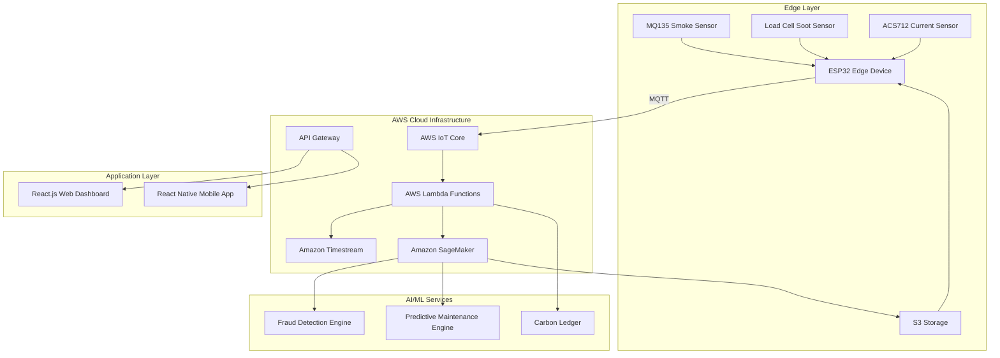
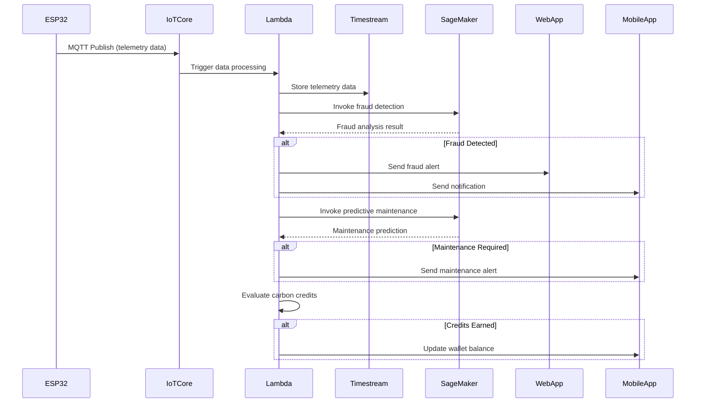
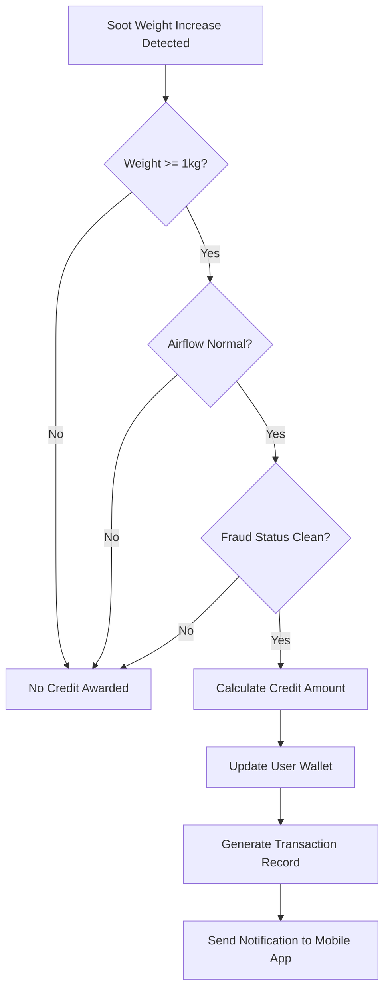
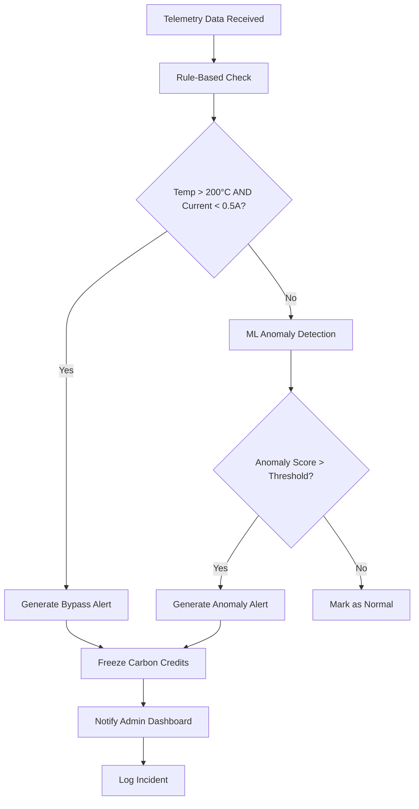

# Design Document: AERIS (AI-Verified Pollution Compliance Network)

## Overview

AERIS is a comprehensive AIoT platform designed to monitor and incentivize pollution compliance in rural brick kilns. The system combines edge computing, cloud infrastructure, AI/ML capabilities, and user interfaces to create a complete monitoring and reward ecosystem. The architecture follows a distributed approach with edge devices collecting telemetry data, cloud services processing and analyzing the data, and client applications providing user interfaces for different stakeholders.

The platform implements a dual-incentive model: fraud detection algorithms ("The Stick") identify tampering attempts and compliance violations, while a carbon credit system ("The Carrot") rewards compliant behavior. This approach ensures both enforcement and positive reinforcement for pollution reduction efforts.

## Architecture

### High-Level Architecture



### Component Architecture

The system is organized into four primary layers:

1. **Edge Layer**: Hardware sensors and ESP32 microcontroller for data collection
2. **Cloud Infrastructure**: AWS services for data ingestion, storage, and processing
3. **AI/ML Services**: Intelligent algorithms for fraud detection, predictive maintenance, and credit management
4. **Application Layer**: User interfaces for kiln owners and government administrators

## Components and Interfaces

### Edge Device Component

**ESP32 Microcontroller**
- **Purpose**: Central processing unit for sensor data collection and transmission
- **Interfaces**: 
  - GPIO pins for sensor connections
  - WiFi module for cloud connectivity
  - MQTT client for data transmission
- **Key Functions**:
  - Sensor data aggregation
  - Local data validation
  - Secure communication with AWS IoT Core
  - Offline data buffering during connectivity issues

**Sensor Array**
- **MQ135 Smoke Density Sensor**
  - Measures air quality and smoke concentration
  - Output: Analog voltage (0-5V) converted to PPM
  - Sampling rate: Every 10 seconds
  
- **Load Cell Soot Weight Sensor**
  - Measures accumulated soot in collection chamber
  - Output: Weight in kilograms with 0.1kg precision
  - Sampling rate: Every 30 seconds
  
- **Thermocouple Temperature Sensor**
  - Measures kiln internal temperature
  - Range: 0-1200°C with ±2°C accuracy
  - Sampling rate: Every 5 seconds
  
- **ACS712 Current Sensor**
  - Measures power consumption of kiln equipment
  - Range: 0-30A with ±1.5% accuracy
  - Sampling rate: Every 5 seconds

### Cloud Infrastructure Components

**AWS IoT Core**
- **Purpose**: Secure device connectivity and message routing
- **Interfaces**:
  - MQTT broker for device communication
  - Device registry for authentication
  - Rules engine for message routing
- **Security**: X.509 certificates for device authentication

**Amazon Timestream Database**
- **Purpose**: Time-series data storage optimized for telemetry
- **Schema**:
  ```sql
  CREATE TABLE telemetry_data (
    device_id VARCHAR(50),
    timestamp TIMESTAMP,
    smoke_density DOUBLE,
    soot_weight DOUBLE,
    kiln_temp DOUBLE,
    power_current DOUBLE,
    location_lat DOUBLE,
    location_lng DOUBLE
  )
  ```
- **Retention**: 2 years for compliance auditing
- **Partitioning**: By timestamp and device_id for query optimization

**AWS Lambda Functions**
- **Data Processing Function**
  - Processes incoming MQTT messages
  - Validates data integrity
  - Stores data in Timestream
  - Triggers fraud detection analysis
  
- **Fraud Detection Function**
  - Implements bypass detection logic
  - Evaluates: `IF Kiln_Temp > 200°C AND Power_Current < 0.5A`
  - Generates alerts and notifications
  
- **Carbon Credit Function**
  - Evaluates credit eligibility
  - Logic: `IF Soot_Weight increases by 1kg AND airflow normal`
  - Updates user wallet balances

**Amazon SageMaker**
- **Purpose**: AI/ML model training and inference
- **Models**:
  - Fraud Detection Model: Anomaly detection using Isolation Forest
  - Predictive Maintenance Model: Time series forecasting using LSTM
- **Training Data**: Historical telemetry patterns and maintenance records
- **Deployment**: Real-time endpoints for inference

### AI/ML Service Components

**Fraud Detection Engine**
- **Algorithm**: Hybrid approach combining rule-based and ML-based detection
- **Rule-Based Detection**:
  ```python
  def detect_bypass(temp, current):
      if temp > 200 and current < 0.5:
          return "BYPASS_ALERT"
      return "NORMAL"
  ```
- **ML-Based Detection**: Isolation Forest for pattern anomaly detection
- **Features**: Temperature patterns, current consumption patterns, sensor correlation analysis
- **Output**: Fraud probability score and alert classification

**Predictive Maintenance Engine**
- **Algorithm**: LSTM neural network for time series prediction
- **Input Features**: 
  - Airflow resistance trends
  - Filter pressure differential
  - Historical maintenance intervals
  - Environmental conditions
- **Prediction Window**: 48-hour advance warning
- **Model Architecture**:
  ```python
  model = Sequential([
      LSTM(50, return_sequences=True, input_shape=(timesteps, features)),
      LSTM(50, return_sequences=False),
      Dense(25),
      Dense(1, activation='sigmoid')
  ])
  ```

**Carbon Ledger**
- **Purpose**: Blockchain-inspired credit tracking system
- **Data Structure**:
  ```json
  {
    "transaction_id": "uuid",
    "device_id": "string",
    "timestamp": "iso_datetime",
    "credit_amount": "number",
    "validation_hash": "string",
    "soot_weight_delta": "number",
    "airflow_status": "normal|abnormal"
  }
  ```
- **Validation Logic**: Multi-factor verification before credit award
- **Immutability**: Transaction history cannot be modified after creation

### Application Layer Components

**React.js Web Dashboard**
- **Target Users**: Government administrators
- **Key Features**:
  - Interactive map with kiln locations
  - Real-time compliance status indicators
  - Fraud alert management interface
  - Compliance reporting and analytics
  - System configuration management

**Component Structure**:
```javascript
// Main Dashboard Component
const AdminDashboard = () => {
  return (
    <div>
      <MapView kilns={kilnData} />
      <AlertPanel alerts={fraudAlerts} />
      <ComplianceMetrics data={complianceData} />
      <ReportGenerator />
    </div>
  );
};
```

**React Native Mobile App**
- **Target Users**: Kiln owners
- **Key Features**:
  - Carbon credit wallet display
  - Real-time system health monitoring
  - Maintenance alert notifications
  - Historical data visualization
  - Offline capability with sync

**Component Structure**:
```javascript
// Main Mobile App Component
const KilnOwnerApp = () => {
  return (
    <NavigationContainer>
      <Tab.Navigator>
        <Tab.Screen name="Dashboard" component={DashboardScreen} />
        <Tab.Screen name="Credits" component={CreditsScreen} />
        <Tab.Screen name="Alerts" component={AlertsScreen} />
        <Tab.Screen name="History" component={HistoryScreen} />
      </Tab.Navigator>
    </NavigationContainer>
  );
};
```

## Data Models

### Telemetry Data Model

```typescript
interface TelemetryReading {
  deviceId: string;
  timestamp: Date;
  smokeDensity: number;      // PPM
  sootWeight: number;        // kg
  kilnTemperature: number;   // °C
  powerCurrent: number;      // Amperes
  location: {
    latitude: number;
    longitude: number;
  };
  dataQuality: 'GOOD' | 'DEGRADED' | 'POOR';
}
```

### Fraud Alert Model

```typescript
interface FraudAlert {
  alertId: string;
  deviceId: string;
  timestamp: Date;
  alertType: 'BYPASS_DETECTED' | 'ANOMALY_DETECTED' | 'SENSOR_TAMPERING';
  severity: 'LOW' | 'MEDIUM' | 'HIGH' | 'CRITICAL';
  triggerConditions: {
    kilnTemp: number;
    powerCurrent: number;
    expectedCurrent: number;
  };
  status: 'ACTIVE' | 'INVESTIGATING' | 'RESOLVED' | 'FALSE_POSITIVE';
  investigationNotes?: string;
}
```

### Carbon Credit Model

```typescript
interface CarbonCredit {
  transactionId: string;
  deviceId: string;
  ownerId: string;
  timestamp: Date;
  creditAmount: number;
  validationCriteria: {
    sootWeightIncrease: number;
    airflowStatus: 'NORMAL' | 'ABNORMAL';
    temperatureRange: {
      min: number;
      max: number;
    };
  };
  transactionHash: string;
  status: 'PENDING' | 'CONFIRMED' | 'REJECTED';
}
```

### User Wallet Model

```typescript
interface UserWallet {
  userId: string;
  deviceId: string;
  currentBalance: number;
  totalEarned: number;
  totalRedeemed: number;
  lastUpdated: Date;
  transactionHistory: CarbonCredit[];
  walletStatus: 'ACTIVE' | 'FROZEN' | 'SUSPENDED';
}
```

### Predictive Maintenance Model

```typescript
interface MaintenanceAlert {
  alertId: string;
  deviceId: string;
  predictedDate: Date;
  alertGenerated: Date;
  maintenanceType: 'FILTER_REPLACEMENT' | 'SENSOR_CALIBRATION' | 'GENERAL_INSPECTION';
  confidence: number;        // 0-1 probability score
  triggerFactors: {
    airflowResistance: number;
    filterPressureDiff: number;
    operatingHours: number;
  };
  status: 'PENDING' | 'SCHEDULED' | 'COMPLETED' | 'OVERDUE';
  actualMaintenanceDate?: Date;
}
```

## Data Flow

### Real-Time Telemetry Flow



### Carbon Credit Award Flow



### Fraud Detection Flow




<function_calls>
<invoke name="prework">
<parameter name="featureName">aeris-pollution-compliance

## Correctness Properties

### Property 1: Sensor Data Collection Timing Consistency
*For any* operational period and any sensor type (smoke, soot, temperature, current), the Edge_Device should collect readings at the specified intervals: smoke every 10 seconds, soot every 30 seconds, temperature and current every 5 seconds.
**Validates: Requirements 1.2, 1.3, 1.4, 1.5**

### Property 2: Data Transmission Timeliness
*For any* collected sensor reading, the Edge_Device should transmit the data to AWS IoT Core within 60 seconds of collection.
**Validates: Requirements 1.6**

### Property 3: Sensor Failure Resilience
*For any* sensor failure scenario, the Edge_Device should log the failure and continue operating with the remaining functional sensors.
**Validates: Requirements 1.7**

### Property 4: Fraud Detection Rule Consistency
*For any* telemetry reading where Kiln_Temp > 200°C AND Power_Current < 0.5A, the Fraud_Detection_Engine should trigger a Bypass_Alert within 30 seconds.
**Validates: Requirements 2.1**

### Property 5: Fraud Incident Recording Completeness
*For any* triggered Bypass_Alert, the AERIS_System should record the incident with timestamp and all relevant sensor values, and maintain this in the fraud incident history.
**Validates: Requirements 2.2, 2.6**

### Property 6: Fraud Alert Notification Consistency
*For any* Bypass_Alert occurrence, the AERIS_System should notify the Government_Administrator via the Web_Dashboard immediately.
**Validates: Requirements 2.3**

### Property 7: Carbon Credit Award Logic
*For any* scenario where Soot_Weight increases by 1kg AND airflow readings are within normal parameters AND no fraud is detected, the Carbon_Ledger should award exactly 1 Carbon_Credit to the kiln owner's wallet and update the balance immediately.
**Validates: Requirements 3.1, 3.3**

### Property 8: Carbon Credit Validation Consistency
*For any* credit award attempt, the Carbon_Ledger should validate soot collection measurements against baseline thresholds before awarding credits.
**Validates: Requirements 3.2**

### Property 9: Transaction History Immutability
*For any* carbon credit transaction (award or deduction), the Carbon_Ledger should maintain an immutable record that cannot be modified after creation.
**Validates: Requirements 3.4**

### Property 10: Fraud-Credit Relationship
*For any* detected fraud incident, the Carbon_Ledger should freeze credit awards for the affected kiln until investigation is complete.
**Validates: Requirements 3.5**

### Property 11: Predictive Maintenance Alert Timing
*For any* airflow resistance pattern indicating filter clog risk, the Predictive_Maintenance_Engine should generate a maintenance alert exactly 48 hours in advance.
**Validates: Requirements 4.2**

### Property 12: Maintenance Alert Notification
*For any* generated maintenance alert, the AERIS_System should notify the kiln owner via the Mobile_App.
**Validates: Requirements 4.3**

### Property 13: Maintenance Data Tracking
*For any* maintenance event (predicted or completed), the AERIS_System should track the completion and correlate it with predicted schedules for model refinement.
**Validates: Requirements 4.5**

### Property 14: Mobile App Real-time Display
*For any* system state change (sensor readings, alerts, credit balance), the Mobile_App should display real-time updates including system health status and notifications with alert details.
**Validates: Requirements 5.2, 5.3, 3.6**

### Property 15: Mobile App Data Visualization
*For any* 30-day period and any transaction history request, the Mobile_App should provide historical charts of telemetry data and display all transactions with timestamps and amounts.
**Validates: Requirements 5.4, 5.5**

### Property 16: Mobile App Offline-Online Synchronization
*For any* offline period followed by connectivity restoration, the Mobile_App should sync all cached data when connectivity is restored.
**Validates: Requirements 5.6**

### Property 17: Web Dashboard Kiln Status Visualization
*For any* kiln status (compliant/non-compliant) and any fraud alert, the Web_Dashboard should color-code kilns appropriately and highlight affected kilns with alert indicators.
**Validates: Requirements 6.2, 6.3**

### Property 18: Web Dashboard Data Access
*For any* kiln selection and any date range/group specification, the Web_Dashboard should provide detailed drill-down views and generate compliance reports.
**Validates: Requirements 6.4, 6.5**

### Property 19: Administrative Configuration Updates
*For any* compliance threshold update, the Web_Dashboard should allow administrators to modify parameters system-wide.
**Validates: Requirements 6.6**

### Property 20: Data Storage and Persistence
*For any* received telemetry data, the AERIS_System should store it in Amazon Timestream with automatic partitioning and persist it within 30 seconds of receipt.
**Validates: Requirements 7.1, 7.2**

### Property 21: Data Retention and Management
*For any* stored telemetry data, the AERIS_System should retain raw data for 2 years and compress historical data older than 90 days.
**Validates: Requirements 7.3, 7.6**

### Property 22: Query Performance Consistency
*For any* standard time range query, the AERIS_System should return results within 5 seconds.
**Validates: Requirements 7.4**

### Property 23: Model Management and Deployment
*For any* model update, the AERIS_System should deploy to production with zero downtime, maintain versioning and rollback capabilities, and log all predictions and outcomes.
**Validates: Requirements 8.3, 8.5, 8.6**

### Property 24: Automated Model Retraining
*For any* monthly interval with new training data OR any model performance degradation below 85% accuracy, the AERIS_System should trigger automatic retraining.
**Validates: Requirements 8.2, 8.4**

## Error Handling

### Edge Device Error Handling

**Sensor Failure Recovery**
- Individual sensor failures should not crash the entire system
- Graceful degradation: continue operation with remaining sensors
- Automatic sensor health monitoring and reporting
- Local logging of all error conditions with timestamps

**Connectivity Issues**
- Offline data buffering for up to 24 hours of telemetry
- Automatic reconnection attempts with exponential backoff
- Data integrity verification after reconnection
- Priority transmission of critical alerts (fraud detection)

**Power Management**
- Low power mode during extended outages
- Critical data preservation in non-volatile memory
- Graceful shutdown procedures to prevent data corruption

### Cloud Infrastructure Error Handling

**AWS Service Failures**
- Multi-region deployment for high availability
- Automatic failover between AWS regions
- Circuit breaker patterns for external service calls
- Dead letter queues for failed message processing

**Data Processing Errors**
- Input validation for all incoming telemetry data
- Malformed data quarantine and alerting
- Retry mechanisms with exponential backoff
- Data quality scoring and degraded mode operation

**AI/ML Model Errors**
- Model inference timeout handling (5-second limit)
- Fallback to rule-based systems when ML models fail
- Model performance monitoring and automatic rollback
- A/B testing framework for model deployment safety

### Application Layer Error Handling

**Mobile App Error Handling**
- Offline mode with local data caching
- Network error recovery with user feedback
- Graceful handling of server timeouts
- Data synchronization conflict resolution

**Web Dashboard Error Handling**
- Real-time connection monitoring
- Automatic retry for failed API calls
- User-friendly error messages with suggested actions
- Session management and automatic re-authentication

## Testing Strategy

### Dual Testing Approach

The AERIS system requires both unit testing and property-based testing to ensure comprehensive coverage:

**Unit Tests**: Focus on specific examples, edge cases, and error conditions
- Integration points between components
- Specific sensor calibration scenarios
- Error handling edge cases
- API endpoint validation

**Property Tests**: Verify universal properties across all inputs
- Comprehensive input coverage through randomization
- Universal correctness properties validation
- System behavior consistency across different scenarios

### Property-Based Testing Configuration

**Testing Framework**: We will use **Hypothesis** for Python components and **fast-check** for JavaScript/TypeScript components.

**Test Configuration**:
- Minimum 100 iterations per property test (due to randomization)
- Each property test must reference its design document property
- Tag format: **Feature: aeris-pollution-compliance, Property {number}: {property_text}**

**Example Property Test Structure**:
```python
from hypothesis import given, strategies as st
import pytest

@given(
    temp=st.floats(min_value=200.1, max_value=1200.0),
    current=st.floats(min_value=0.0, max_value=0.49)
)
def test_fraud_detection_bypass_alert(temp, current):
    """
    Feature: aeris-pollution-compliance, Property 4: Fraud Detection Rule Consistency
    For any telemetry reading where Kiln_Temp > 200°C AND Power_Current < 0.5A,
    the Fraud_Detection_Engine should trigger a Bypass_Alert within 30 seconds.
    """
    # Test implementation
    result = fraud_detection_engine.analyze(temp, current)
    assert result.alert_type == "BYPASS_ALERT"
    assert result.response_time <= 30.0
```

### Testing Coverage Requirements

**Edge Device Testing**:
- Sensor simulation and mocking
- Network connectivity failure scenarios
- Power management and recovery testing
- Data integrity verification

**Cloud Infrastructure Testing**:
- Load testing for high-volume telemetry ingestion
- Fault injection testing for AWS service failures
- Data consistency testing across distributed components
- Security penetration testing

**AI/ML Model Testing**:
- Model accuracy validation with test datasets
- Adversarial testing for fraud detection robustness
- Performance benchmarking for inference latency
- Model drift detection and alerting

**Application Layer Testing**:
- Cross-platform compatibility testing (iOS/Android)
- Browser compatibility testing for web dashboard
- Accessibility compliance testing
- User experience testing with real stakeholders

### Integration Testing Strategy

**End-to-End Testing**:
- Complete data flow from edge device to user interfaces
- Multi-user scenario testing (concurrent kiln owners and administrators)
- Real-time notification delivery verification
- Cross-component data consistency validation

**Performance Testing**:
- System scalability testing (1000+ concurrent kilns)
- Database query performance optimization
- Real-time processing latency measurement
- Mobile app responsiveness under various network conditions

### Continuous Testing Pipeline

**Automated Testing**:
- Unit and property tests run on every code commit
- Integration tests run on pull request creation
- Performance regression testing on release candidates
- Security scanning and vulnerability assessment

**Manual Testing**:
- User acceptance testing with actual kiln owners
- Government administrator workflow validation
- Hardware integration testing in controlled environments
- Field testing with pilot kiln installations
